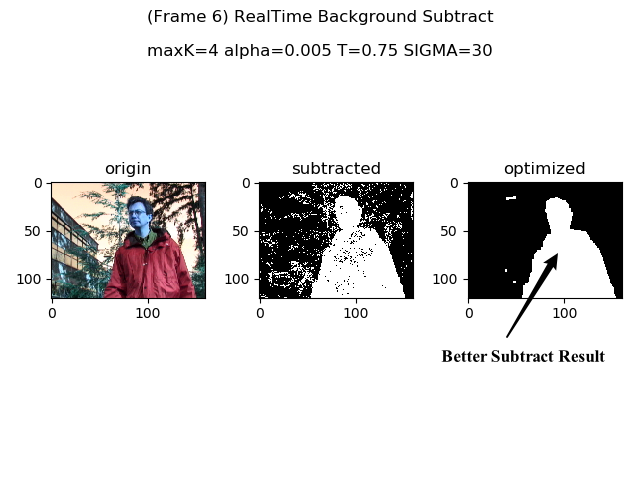

# Background Subtract Based on Gaussian Mixture Model (GMM)
This project is an implementation for Background Subtract based on GMM model, coded in Python language.

Here we use [Test Images for Wallflower Paper](https://www.microsoft.com/en-us/download/details.aspx?id=54651) to train our background model and test the subtract result.

To improve the subtract result, we use Mathematical Morphology to remove noise and reconnect the disconnected component.

## Project Structure
+ Runnable Python source files are [singleChannel.py](./singleChannel.py) and [multiChannels.py](./multiChannels.py), each of which is implemented on Gray Scale and RGB Scale.
JUST CLONE THE REPOSITORY AND RUN IT!
+ Dataset is in [WavingTrees](./WavingTrees) directory, which contains two subdirectories which are [background_train](./WavingTrees/background_train) for model training and [person_in](./WavingTrees/person_in) for model testing.
+ Models which have already been learned with different parameters are in [models_learned](./models_learned) directory, so that you can move quickly to testing stage.

## Algorithm Process of Making Hybrid Image
+ Background Model Learning
+ Foreground Person Detecting

## Results Representation
+ Single Frame
  ------

+ Demo Video
  ------

## Dependency
* [OpenCV 3.4.1](https://opencv.org/opencv-3-4-1/)

## References
* [1] Stauffer C , Grimson W E L . Adaptive background mixture models for real-time tracking[C]// IEEE Computer Society Conference on Computer Vision & Pattern Recognition. IEEE Xplore, 2007.

## Author Info
LeoHao (XMU-CS)

## Date
2020.10.22

